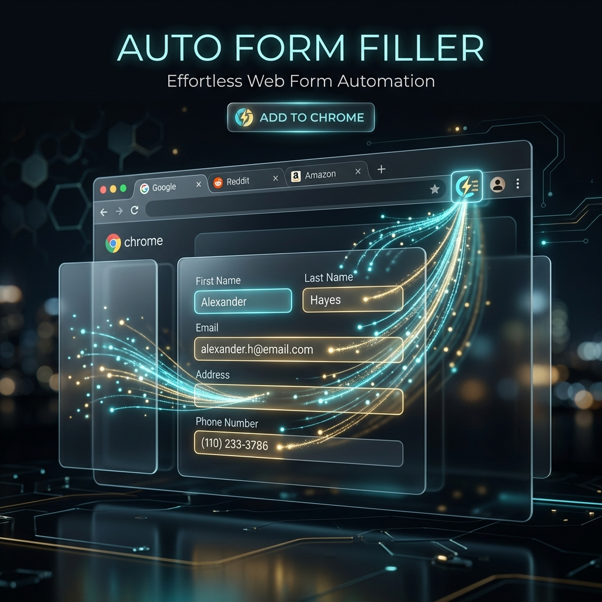

# turbo-ai-form-filler



> **AI-powered Chrome extension that eliminates the manual effort of filling job application forms — press one shortcut and let the AI handle the rest.**

[](https://github.com/kethanva/turbo-ai-form-filler/actions/workflows/ci.yml)
[](LICENSE)
[](manifest.json)
[](CONTRIBUTING.md)

---

## 🎯 The Problem It Solves

Active job seekers routinely apply to **50–100+ positions per month**. Every application asks the same information — work history, education, skills, salary expectations, notice period — but spread across a dozen different ATS platforms, each with their own layout. The result is hours of repetitive, low-value data entry that delays applications and causes burnout.

**turbo-ai-form-filler** solves this by:
- Storing your professional profile once in a structured JSON format.
- Intelligently mapping your profile to any form field using an LLM, regardless of how the question is phrased.
- Filling the entire form in seconds, so you can focus on personalizing your cover letter and preparing for interviews — the parts that actually matter.

---

## ✨ Features

- **🚀 One-Click Fill**: Fill entire complex multi-page job applications in seconds.
- **🧠 Context-Aware AI**: Uses advanced LLMs (Groq, HuggingFace) to understand question intent and map your profile accurately — not just keyword matching.
- **🛡️ Privacy First**: Your profile and API keys are stored locally in Chrome. Nothing is sent to any external server except the LLM API you configure.
- **🌍 Universal ATS Support**: Works on LinkedIn Easy Apply, Workday, Greenhouse, Lever, Ashby, iCIMS, SAP SuccessFactors, and more.
- **💰 Effectively Free**: Optimized for Groq's generous free tier — fill thousands of applications without spending anything.
- **⚡ Intelligent Fallback**: If the LLM API is unavailable, the extension automatically falls back to offline fuzzy-matching against your profile.

---

## 🏗️ Supported Platforms

| Platform | Notes | Status |
|---|---|---|
| **LinkedIn Easy Apply** | Multi-step modal forms | ✅ Stable |
| **Workday** | Complex date spinbuttons, multi-page | ✅ Stable |
| **Greenhouse** | Standard multi-section layout | ✅ Stable |
| **Lever** | Application + optional questions | ✅ Stable |
| **Ashby** | Modern React-based forms | ✅ Stable |
| **iCIMS** | Legacy form layouts | ✅ Stable |
| **SAP SuccessFactors** | Enterprise ATS | ✅ Stable |
| **Clinch Talent** | Custom label hashing — stripped automatically | ✅ Stable |
| **Freshteam / Freshworks** | Employer/education repeater groups | ✅ Stable |
| **GEM ATS** | Sourcing-integrated applications | ✅ Stable |
| **Generic HTML Forms** | Any standard web form | ✅ Experimental |

> [!NOTE]
> The extension uses `⌘⇧F` (Mac) or `Ctrl+Shift+F` (Windows/Linux) on any supported page to begin filling.

---

## 📺 How It Works

```
Open a job application page
        │
        ▼
Press ⌘⇧F / Ctrl+Shift+F
        │
        ▼
Extension scans the DOM — finds all inputs, selects, textareas,
and custom components (comboboxes, date pickers, listboxes)
        │
        ▼
Extracts a human-readable label for each field
(checks aria-labelledby, label[for], fieldset legend, placeholder, ...)
        │
        ▼
Batch-sends all questions + your structured profile to the LLM
        │
        ├─ LLM returns a structured answer map
        │
        └─ Fallback: offline fuzzy-match if API is unavailable
        │
        ▼
Fills each field and dispatches the correct DOM events
(ensures React/Angular/Vue frameworks detect the changes)
        │
        ▼
Popup shows filled count. Review, adjust if needed, and submit.
```

---

## 🚀 Getting Started

### Option 1: Run the Setup Script (Recommended)

```bash
git clone https://github.com/kethanva/turbo-ai-form-filler.git
cd turbo-ai-form-filler
./setup.sh        # macOS / Linux
# setup.bat       # Windows
```

This handles everything: creates your local config files, installs dependencies, and builds the extension. Then load it in Chrome:
- Open `chrome://extensions`
- Enable **Developer mode** (top-right toggle)
- Click **Load unpacked** → select the `turbo-ai-form-filler` folder

### Option 2: Download a Release

1. Go to [Releases](../../releases) and download the latest `release.zip`.
2. Unzip it and load the folder using the same steps above.

---

## ⚙️ Configuration

### 1. Add an API Key

Click the extension icon → **Settings** → **API Keys**.

| Provider | Cost | Speed | Recommendation |
|---|---|---|---|
| **Groq** (Primary) | **~$0.1 / 10¢ / ₹9** per month | ⚡ Ultra Fast | **Best Value.** Most economical choice. |
| **HuggingFace** | Free (Rate Limited) | Moderate | Good backup option. |

> [!IMPORTANT]
> **Why Groq?** It is significantly more economical and convenient than using expensive LLM APIs (OpenAI/Claude) or setting up complex local Ollama servers. For a typical heavy job search, your monthly bill will likely be **less than $0.10 (10 cents / 9 Rupees)**. It is essentially free while providing state-of-the-art speed.

### 2. Build Your Profile

Click the extension icon → **Settings** → **Profile** tab. Paste your details as JSON. The profile is the single source of truth the LLM uses to answer every question.

```json
{
  "first_name": "Jane",
  "last_name": "Doe",
  "email": "jane.doe@example.com",
  "phone": "1234567890",
  "years_of_experience": 8,
  "skills": ["TypeScript", "React", "Node.js", "AWS"],
  "notice_period": "30 days",
  "require_visa_sponsorship": false,
  "willing_to_relocate": true,
  "experience_details": [
    {
      "companyKey": "acme_corp",
      "title": "Senior Software Engineer",
      "from": "2020-03",
      "to": "Present",
      "location": "San Francisco, CA",
      "highlights": [
        "Led migration of monolith to microservices, reducing deployment time by 60%",
        "Mentored a team of 5 engineers across two product squads"
      ]
    },
    {
      "companyKey": "startup_xyz",
      "title": "Software Engineer",
      "from": "2017-06",
      "to": "2020-02",
      "location": "New York, NY",
      "highlights": ["Built core payment processing pipeline handling $2M/day"]
    }
  ],
  "education_details": [
    {
      "degree": "Master of Science",
      "field": "Computer Science",
      "institution": "State University",
      "from": "2015",
      "to": "2017"
    }
  ]
}
```

> [!TIP]
> The full field reference is in [config/personals.example.json](config/personals.example.json). Key fields that improve LLM accuracy: `user_information_all` (a free-text paragraph summary), `desired_salary`, `current_ctc`, and `veteran_status`.

---

## 💡 Tips for an Effective Job Search

- **Review before submitting.** The extension fills forms based on your profile — always review answers for custom questions unique to the role before hitting submit.
- **Keep your profile current.** Update `experience_details` whenever your situation changes (new role, new notice period, etc.).
- **Use the highlights field.** Descriptive bullet points in `highlights` give the LLM better context for open-ended questions like "Describe a challenge you overcame."
- **Salary fields.** Set `desired_salary`, `current_ctc`, and `expected_ctc` in your profile so the extension fills compensation fields consistently.
- **Cover letter.** Add a `cover_letter` field to your profile for platforms that ask for a generic motivation statement.

---

## 🛠️ Tech Stack

| Component | Technology |
|---|---|
| Language | TypeScript (strict mode) |
| Build | esbuild + tsc |
| Extension API | Chrome Manifest V3 |
| Primary LLM | Groq (llama-3.1-8b-instant) |
| Fallback LLM | HuggingFace (Llama-3.2-3B-Instruct) |
| Offline Fallback | Levenshtein fuzzy matching |
| Profile Storage | `chrome.storage.local` (no size limit) |
| API Key Storage | `chrome.storage.sync` (encrypted by Chrome) |

---

## 🤝 Contributing

Contributions are welcome and greatly appreciated. The most impactful areas for contribution are:

- **New ATS support**: Add a platform that isn't currently handled.
- **Test suite**: Unit tests for date parsing, label extraction, and field-filling logic.
- **`content.ts` refactor**: Split the main module into focused, platform-specific sub-modules.

See [CONTRIBUTING.md](CONTRIBUTING.md) for the full process.

---

## 🔒 Security & Privacy

This extension was designed with a privacy-first approach:

- Your profile JSON is stored in `chrome.storage.local` (device-local, encrypted by Chrome OS).
- API keys are stored in `chrome.storage.sync` (synced across your signed-in Chrome instances, never exposed to page scripts).
- The only data sent externally is the form field labels + your profile, sent to the LLM provider you configure.
- No telemetry, no crash reporting, no usage tracking of any kind.

See [SECURITY.md](SECURITY.md) for vulnerability reporting.

---

## 📄 License

Distributed under the MIT License. See [LICENSE](LICENSE) for more information.
